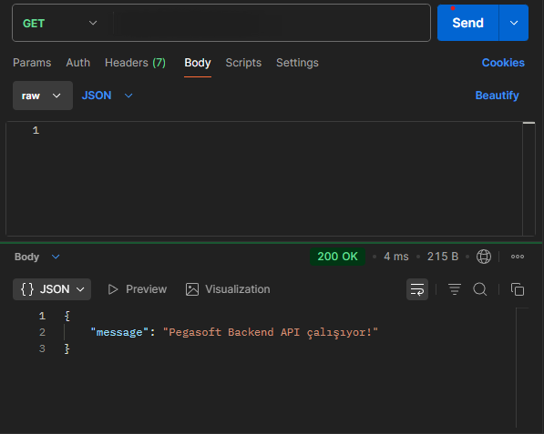
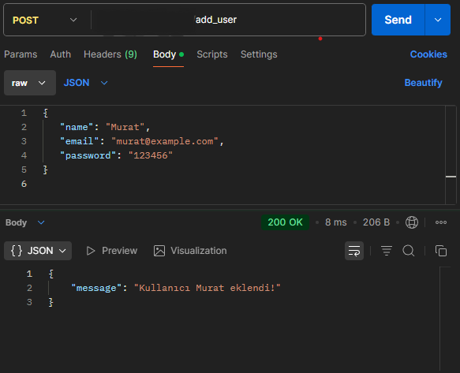
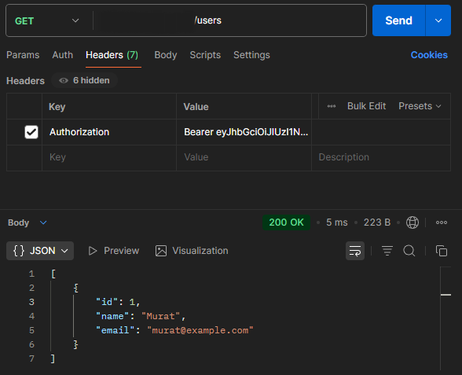
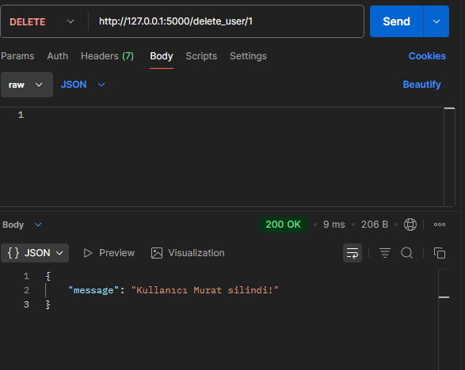

# Pegasoft Backend API Projesi

Flask ile geliştirilmiş kullanıcı yönetimi API'si. 
JWT ile login sistemi, kullanıcı ekleme, listeleme ve silme işlemleri yapılabilir.

## 🚀 Özellikler
- Kullanıcı Ekle (POST)
- Login (JWT Token)
- Kullanıcı Listeleme (GET - Token Gerektirir)
- Kullanıcı Silme (DELETE)

## 📸 API Testleri (Postman)
Aşağıda Postman ile yapılan testlerin ekran görüntüleri bulunmaktadır.

### API Port Testi


### Kullanıcı Ekleme


### Login İşlemi


### Kullanıcı Listeleme


### Kullanıcı Silme


## ⚙️ Kurulum
```bash
pip install -r requirements.txt
python app.py
